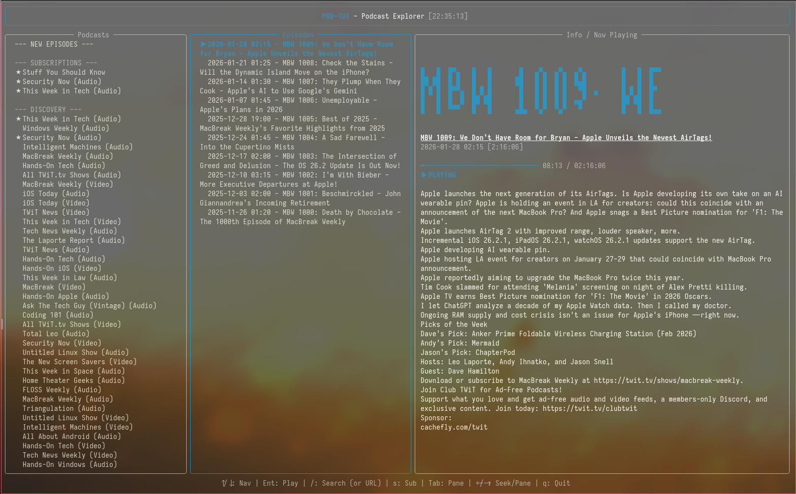
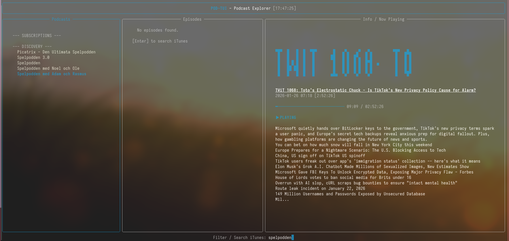
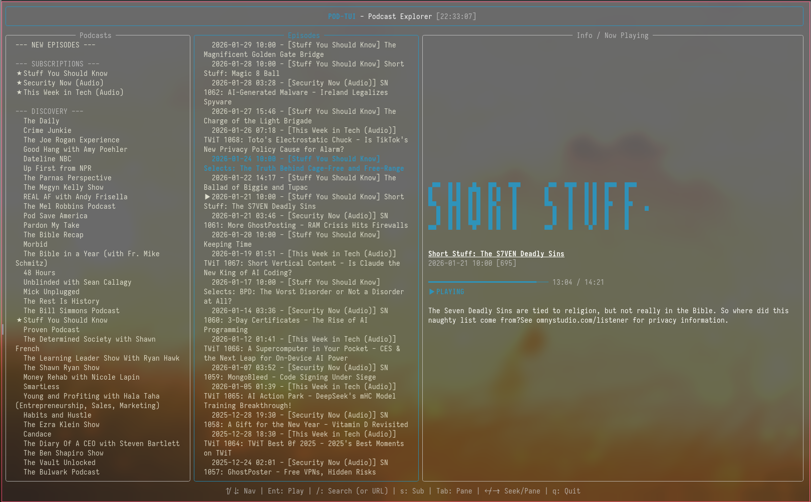
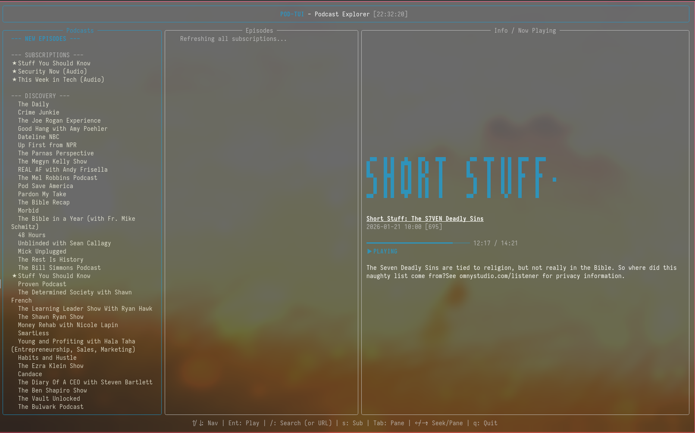

# POD-TUI

A terminal-based podcast explorer designed for a clean and efficient listening experience. Based on the SR-TUI aesthetic, it supports podcasts from any source.

## Interface and Navigation
The application features a three-pane layout providing quick access to your podcast library, episode lists, and detailed playback information.

## Search and Discovery
Find any show using the integrated search functionality which queries the global podcast database. You can also add custom RSS feeds by pasting a direct URL into the search bar.

## Global Feed
The New Episodes section aggregates the latest releases from all your subscriptions into a single chronological view.

## Subscriptions
Manage your favorite podcasts easily. Subscriptions are saved locally and updated automatically.

| | |
|:---:|:---:|
|  |  |

## Features
- Search: Find podcasts via the iTunes API.
- RSS Support: Add custom RSS feeds directly through the search bar.
- Subscribe: Save your favorite podcasts.
- Auto-Sorting: Subscriptions are automatically sorted with the latest episodes at the top.
- Design: Consistent Blue theme focusing on readability.
- Playback Control: Seek forward/backward and pause/resume functionality.

## Installation
1. Clone the repository.
2. Run `./install.sh`.
3. Launch with `pod-tui`.

## Keyboard Commands

| Key | Mode | Function |
|---------|----------|----------|
| `Tab` | App | Cycle between panes (Podcasts / Episodes / Now Playing) |
| `↑` / `↓` | Lists | Navigate up/down in lists |
| `Enter` | Podcasts | Select podcast and load episodes |
| `Enter` | Episodes | Play selected episode |
| `Space` | Player | Pause / Resume playback |
| `s` | Podcasts | Toggle subscription |
| `/` | Podcasts | Search podcasts or add RSS URL |
| `→` | Podcasts / Episodes | Focus next pane to the right |
| `←` | Episodes / Now Playing | Focus previous pane to the left |
| `→` | Now Playing | Seek forward 10 seconds |
| `←` | Now Playing | Seek backward 10 seconds |
| `Esc` | Search | Exit search mode |
| `q` | App | Quit application |
